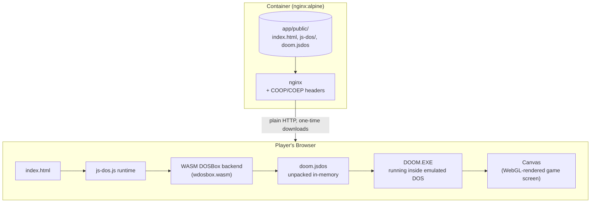
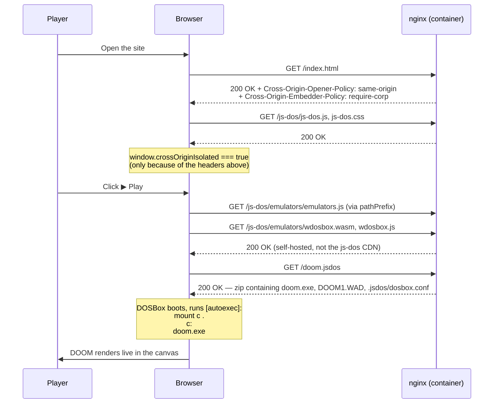

# Phase 0: App Skeleton

## Goal

Get the original DOOM shareware episode running in a browser via js-dos,
served from a container that can be built and run with plain `docker build`
/ `docker run` — no dev server, no scaffolding, no cloud dependency. This is
the foundation every later phase builds on: Terraform (Phase 2) deploys this
exact image, CI (Phase 3) builds it, CD (Phase 4) ships it.

## What was built

```
mulzatech-doom-azure/
  app/
    Dockerfile
    nginx.conf
    public/
      index.html
      js-dos/          ← self-hosted js-dos v8.4.1 runtime (JS + WASM)
      doom.jsdos        ← game bundle: DOOM1.WAD + doom.exe + dosbox.conf, zipped
  docs/
    adr/                ← architecture decisions
    phases/              ← this file
```

## Architecture

Everything that makes DOOM playable — the DOS emulator, the CPU emulation,
the game itself — runs **entirely inside the player's browser** as
WebAssembly. The container's only job is to hand over static files over
plain HTTP. There is no game server, no per-player backend process, and no
persistent connection once the files are downloaded.



This is the direct payoff of [ADR 0002](../adr/0002-js-dos-vs-vnc.md): because
emulation happens client-side, the container stays a stateless static file
server — the same shape Azure Container Apps' ingress is built around, and
the same shape that scales to more players without needing more server-side
compute per session.

## Boot sequence



## Troubleshooting log

Getting from "files exist" to "DOOM actually renders" took four separate,
non-obvious fixes, each hiding behind a black screen with no error message.
Documenting them here because each one will matter again in later phases
(Dockerfile/nginx config, CD, cache-busting on redeploy).

### 1. Silent hang — missing `SharedArrayBuffer`

**Symptom:** Page loads, js-dos's own UI (play button, version banner)
renders fine, but clicking Play just leaves a black screen forever. No
console errors.

**Investigation:** Checked `window.crossOriginIsolated` in the browser —
`false`. `typeof SharedArrayBuffer` — `undefined`.

**Root cause:** js-dos's WASM DOSBox backend uses `SharedArrayBuffer` to
share memory between its Web Worker (running the CPU emulation) and the main
thread. Browsers only expose `SharedArrayBuffer` on pages that are
**cross-origin isolated**, which requires two specific response headers on
every response. A plain `python -m http.server` (used for local testing at
this point) doesn't send them, so the browser silently disables
`SharedArrayBuffer` and js-dos's worker hangs waiting for something that
will never arrive.

**Fix:** Serve every response with:
```
Cross-Origin-Opener-Policy: same-origin
Cross-Origin-Embedder-Policy: require-corp
```
This became the `add_header ... always;` lines in `app/nginx.conf`.

### 2. Explicit error — CDN blocked by the very headers that fixed #1

**Symptom:** After adding the headers above, the black screen became an
actual visible error: *"Unable to add emulators.js. Probably you should set
the 'pathPrefix' option to point to the js-dos folder."*

**Investigation:** `Cross-Origin-Embedder-Policy: require-corp` doesn't just
enable `SharedArrayBuffer` — it also means the browser now **blocks** any
subresource that isn't same-origin and doesn't explicitly opt in with a
`Cross-Origin-Resource-Policy` header. js-dos's default config loads its
WASM backend files from `https://v8.js-dos.com/latest/emulators/`, which
doesn't send that header — so enabling COEP simultaneously fixed
`SharedArrayBuffer` and broke the default CDN loading path.

**Fix:** Pass `pathPrefix: "js-dos/emulators/"` to the `Dos()` call in
`index.html`, pointing it at the emulator backend files we'd already
self-hosted (per [ADR 0002](../adr/0002-js-dos-vs-vnc.md)'s "own every
layer" reasoning) instead of the CDN default.

### 3. Silent hang again — DOOM.EXE never actually ran

**Symptom:** Both fixes above applied, `doom.jsdos` downloads successfully
(confirmed via Resource Timing API — correct byte size, no errors), the WASM
backend loads, a WebGL context gets created on the canvas — and it's still
black. Sampling the canvas's actual pixel buffer directly showed literally
**zero** draw calls had ever happened.

**Investigation:** Isolated the problem by testing with js-dos's own official
demo bundle (`digger.jsdos`) through the identical self-hosted setup —it
rendered instantly. That proved the whole environment (headers, self-hosted
runtime, `pathPrefix`) was correct, and the bug was specific to our bundle.
Diffing Digger's `dosbox.conf` against ours showed Digger's `[autoexec]`
included `mount c .` and `c:` before running the game; ours went straight to
`DOOM.EXE`.

**Root cause:** DOSBox never automatically treats a bundle's files as a
usable drive. Without `mount c .`, `DOOM.EXE` was being run against
DOSBox's own internal `Z:` drive, which doesn't have our game files on it.
The command failed silently, and the very next `[autoexec]` line (`exit`)
immediately closed the DOS session — before DOOM ever got the chance to set
a video mode, which is why the canvas never resized past its default
300×150 placeholder and never received a single draw call.

**Fix:** Updated `.jsdos/dosbox.conf`'s `[autoexec]`:
```ini
[autoexec]
mount c .
c:
doom.exe
exit
```
(Also switched `DOOM.EXE` to lowercase `doom.exe` to match the real filename
exactly — the zip-backed virtual filesystem js-dos mounts is case-sensitive,
unlike real DOS.)

### 4. Old bug, back from the dead — stale bundle cache

**Symptom:** After confirming the fix worked once, a fresh reload of the
*exact same* fixed bundle went back to a black screen — with the exact same
symptoms as #3.

**Investigation:** Inspected the browser's Origin Private File System (a
separate storage mechanism from both IndexedDB and the HTTP cache) via
`navigator.storage.getDirectory()`, and found:
```
/jsdos/caches/bundles/doom.jsdos
```

**Root cause:** js-dos caches downloaded `.jsdos` bundles in OPFS, keyed by
filename, to avoid re-downloading on repeat visits. It had cached the very
first, broken (pre-`mount c .`) version of `doom.jsdos` from earlier testing
under that exact filename and origin, and kept silently serving that stale
copy instead of re-fetching — even though the file on disk (and over HTTP)
was already fixed.

**Fix (for the moment):** Clear the cached entry (DevTools → Application →
Storage → *Clear site data*, or an Incognito window for a clean test).

**Why this matters beyond Phase 0:** this will happen again in production —
anyone who's already loaded the game once will keep playing a stale
`doom.jsdos` after any future redeploy to the same URL, until they clear
site data. Worth revisiting as a real cache-busting concern once Phase 4
(CD) exists — e.g. content-hashing the bundle filename on each deploy.

### 5. No sound — confirmed upstream limitation, auto-start rejected as a "fix"

**Symptom:** The game runs and renders correctly, but no audio ever plays.
Console shows: `Can't create audio node with sampleRate === 0, ingnoring`
(typo is js-dos's own, not ours).

**Investigation:** Traced into `js-dos.js`'s source. It reads the DOS
session's sound frequency exactly once, and if that reads `0` at that
moment (which it does — DOS's sound subsystem hasn't finished initializing
yet when js-dos checks), it logs the warning and permanently gives up, with
no retry logic and no exposed public API to trigger one manually. Confirmed
this isn't specific to our bundle — js-dos's own official demo (`digger.jsdos`)
produces the identical warning through the identical setup. Also confirmed
we're already on js-dos's latest published version (8.4.1), so there's no
newer release to upgrade to that might fix it.

**Considered and rejected: `autoStart: true`.** js-dos supports skipping
the "click Play to begin" screen entirely. It was tempting as a UX
improvement, but browsers only allow audio playback as a direct result of
a trusted user gesture (click/tap/keypress) — and the existing Play button
click is currently the *only* such gesture in this page. Auto-starting
would remove it entirely, which wouldn't just leave the sound bug unfixed —
it would make audio **structurally impossible**, even if js-dos patches
this bug in a future release. Decided to keep the click-to-play button
specifically to preserve that possibility, and accept the current
"boots via one click" UX as the tradeoff.

**Status:** documented known limitation, not pursued further — no
reasonable fix available within this project's control.

## Tradeoffs and things deferred to later phases

- **No cache-busting strategy yet.** Noted above; addressed once there's an
  actual deploy pipeline to hook it into (Phase 4).
- **No `docker-compose.yml` yet.** Phase 0's bar was "runs with plain
  `docker run`" per the project plan; local-dev ergonomics (compose,
  volumes for faster iteration) are explicitly Phase 1 scope.
- **`nginx.conf` is minimal.** No gzip/brotli compression, no cache-control
  headers on static assets, no logging tuning. Fine for "does it run"; worth
  revisiting once there's a real deployment to optimize for (Phase 2+).
- **Image not yet slimmed or scanned.** No multi-stage build tricks, no
  vulnerability scanning in this phase — that's CI territory (Phase 3).
